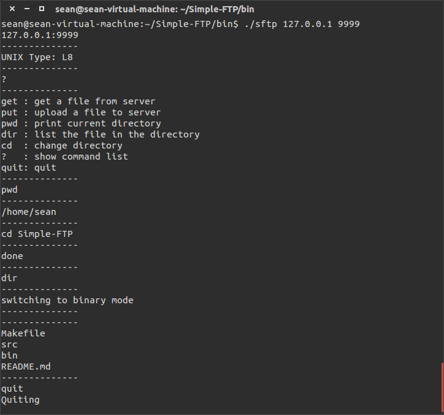

# Simple-FTP
A simple FTP daemon and client in `C++`. It implements a tiny but essential subset of File Transport Protocol, RFC 959. Supported FTP commands include:

- USER for username.
- PASS for password.
- SYST for system information.
- PWD  for present working directory.
- TYPE for connection type.
- PORT for the port number on client, used in active mode.
- LIST for `ls` in bash.
- RETR for downloading a file.
- STOR for uploading a file.

Notice that it only supports active mode, which means that the server won't work if the client is behind a NAT.

### How to use it?
After downloading it, just make it.

```
> cd Simple-FTP
> make
```

This will build a simple FTP server and client in `bin` directory. To use it, first start the server in one terminal:

```
> cd bin
> ./sftpd
```

The server will be running at TCP port 9999. Of course you can modify the code and make it take user-specified port number.

Now it's time to start the client. Open another terminal and type the following command.

```
> cd bin
> ./sftp 127.0.0.1 9999
```

Here is a simple screen shot for the client.
<div style="margin: 0 auto">

</div>

### Concurrency
One key problem for a server is to handle concurrency. There are basically two way to do this, multiple threads and pending queue. Here I simply used `select()` method to model a pending queue for multiple cilents. Each time the server selects one client and handle its request. After that it handles next one and this goes for an infinite loop.

This idea to handle concurrency is implemented in an abstract base class `Server`. `Server` leaves two functions unimplemented, `handle_new_client()` and `handle_exist_client()`. These two functions will be called at proper time.

### Session
As mentioned above, the `FTPServer` class only needs to implement two functions. Notice that unlike http, ftp is based on session and both the server knows who it's talking to.

Thus, the core of `FTPServer` is `Session` class. Each `Session` models the conversation between the server and a specific client. When a new client comes, the server first new a `Session` for it and then let `Session` handles everything. The rest is just implemented according to the protocol.

### Client
The client is really simple and crude. At first I used [FileZilla](https://filezilla-project.org/) as the client to test the server, but it's really painful, so I implemented this dummy client first. Don't laugh at me!
